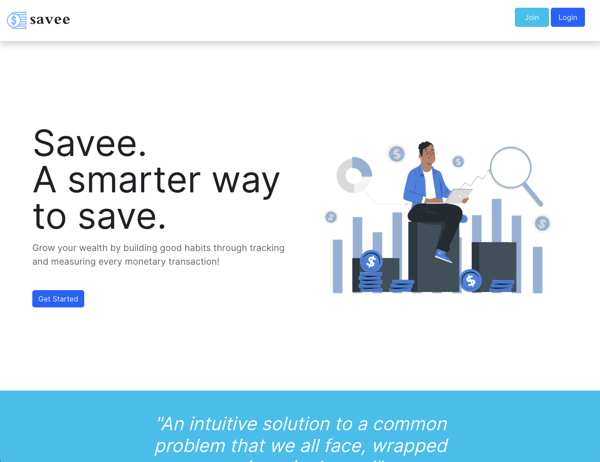
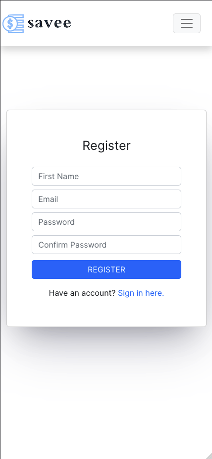
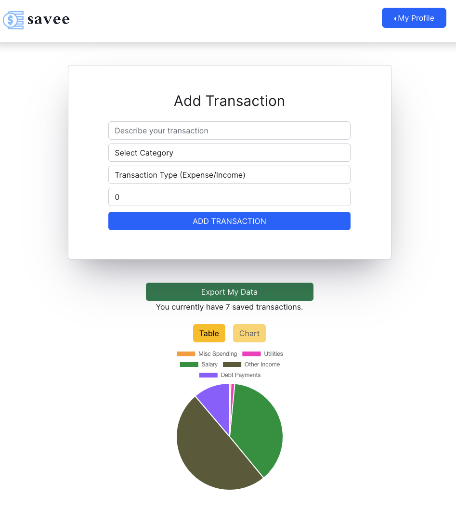
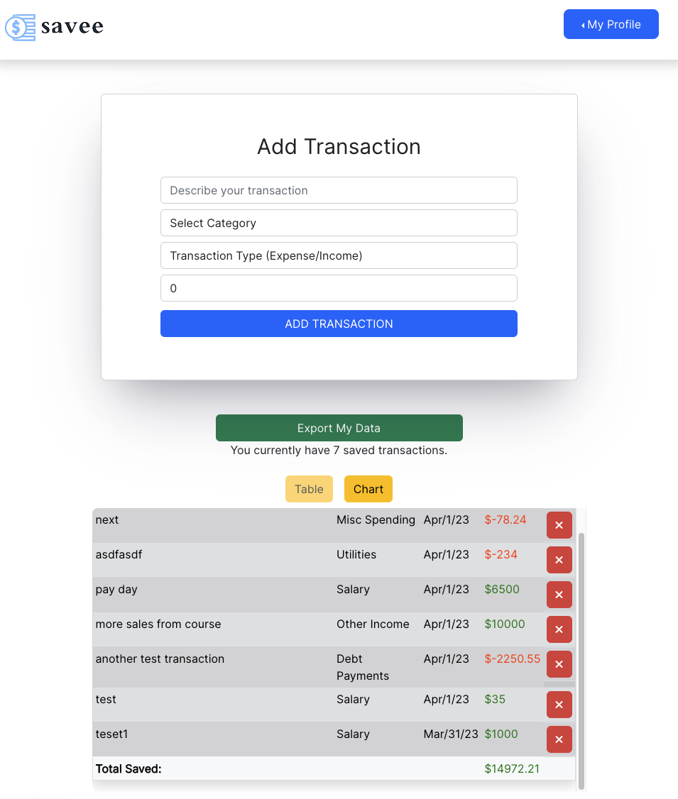

# Savee - A Smarter way to save!

- Savee is a tool that helps you reach your financial goals. Just log your transactions and watch your savings grow!

# Deployment

https://savee.netlify.app/

# Tech Stack

- [React](https://react.dev/)
- [TypeScript](https://www.npmjs.com/package/typescript)
- [Firebase](https://firebase.google.com/)
- [Chart.js](https://www.npmjs.com/package/react-chartjs-2)

# Features

- Clean code, written with TypeScript and React.
- Fully mobile responsive design

# Screenshots:

Landing Page

The site is mobile responsive as seen on this mobile landing page

After deciding to join the app, the user is presented with a login page

The user's dashboard can be toggled between tabular data and chart data

# To Play Locally

- `git clone` this repository
- `cd savee`
- `npm i`
- `npm run start`
- Ideally you will also require a firebase configuration which you can initialize at the [firebase website](www.firebase.google.com)
- Drop your configuration keys into a `.env` file, add that file to `.gitignore`

# Future Plans

- TODO: Migrate to vite over create-react-app
- TODO: create a separate page for analytics (dashboard should have specific information on user's account)
- TODO: modal for new transactions so a transaction can be added from any page
- TODO: add section for monthly savings goal, display a progress bar indicating the percentage completion to this goal.
